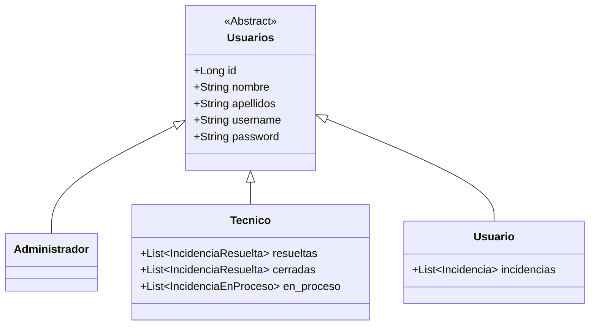
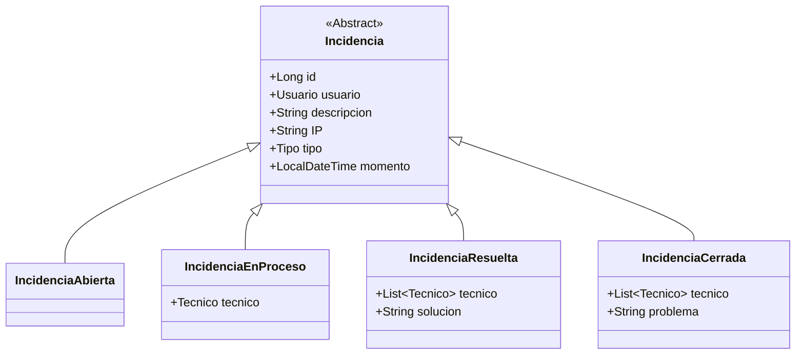
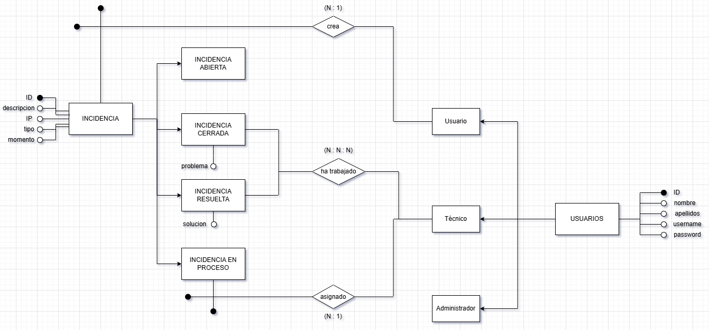

# Modelado

En este proyecto, estoy haciendo una página de gestión de incidencias informáticas.

Estas incidencias constarán de una **estado, descripción, tipo, fecha y hora, y IP del equipo afectado**.
Podrán tener 4 estados:
- **Abierta**: Aún no se ha asignado a ningún técnico.
- **En proces**o: La incidencia tendrá un técnico asignado y estará en proceso de ser resuelta.
- **Resuelta**: La incidencia ha sido resuelta, y se almacenará el ténico que la resolvió, la fecha, y una breve descripción de cómo se logró.
- **Cerrada**: La incidencia no pudo ser resuelta, se almacenará qué técnico intentó hacerlo, en qué fecha y hora y una breve descripción de la problemática. Estas incidencias podrán ser re-abiertas para resolverlas en otro momento.

Habrá 3 tipos de usuario:
- **Usuarios**: Pueden iniciar sesión con sus credenciales y reportar una incidencia mediante un formulario. Los usuarios no pueden registrarse de ninguna manera, pues es una aplicación diseñada para uso corporativo.
- **Técnicos**: Podrán visualizar una lista de incidencias pendientes, teniendo opción de ordenarlas por tipo y/o fecha. El técnico podrá asignarse una incidencia para resolverla él y no colisionar con sus compañeros. También podrá visualizar a qué técnico le fue asignada cada incidencia así como su estado.
- **Administradores**: Tendrán capacidad de gestionar todo tipo de datos, pudiendo borrar por completo incidencias y administrar tanto usuarios como sus respectivos roles. Existirá también una funcionalidad para importar usuarios / técnicos masivamente desde CSV.

---
# Diagramas de clases

### Usuarios

### Incidencias

---

# Diagrama entidad-relación

---
# Flujo incidencias

---
# Endpoints para gestión de usuarios

## (**POST**) `/api/user/create` 
Crea un usuario en la base de datos.
 
 | Campo | Tipo | Requerido | Descripción |
  | :--- | :--- | :---: | :--- |
  | **username** | `String` | ✅ | Identificador único de acceso (debe ser único). |
  | **password** | `String` | ✅ | Contraseña de seguridad. |
  | **nombre** | `String` | ✅ | Nombre de pila del usuario. |
  | **apellido** | `String` | ✅ | Apellido(s) del usuario. |
  | **privilegios** | `String` | ✅ | Rol en el sistema: `tecnico`, `administrador` o `usuario`. |

## (**PUT**) `/api/user/update/{id}` 
Actualiza los datos de un usuario. No actualiza la contraseña.

| Campo        | Tipo     | Requerido | Descripción                                           |
  |:-------------|:---------| :---: |:------------------------------------------------------|
| **id**       | `long`   | ✅ | ID del usuario a actualizar                           |
| **username** | `String` | ✅ | Nuevo identificador único de acceso (debe ser único). |
| **nombre**   | `String` | ✅ | Nuevo nombre de pila del usuario.                     |
| **apellido** | `String` | ✅ | Nuevo apellido(s) del usuario.                        |

## **(POST)** `/api/user/disable/{id}`
Da de baja un usuario para que no aparezca listado.

| Campo        | Tipo     | Requerido | Descripción                  |
  |:-------------|:---------| :---: |:-----------------------------|
| **id**       | `long`   | ✅ | ID del usuario a dar de baja |

## **(POST)** `/api/user/enable/{id}`
Da de alta un usuario para que  aparezca listado otra vez.

| Campo        | Tipo     | Requerido | Descripción                  |
  |:-------------|:---------| :---: |:-----------------------------|
| **id**       | `long`   | ✅ | ID del usuario a dar de alta |

## (**GET**) `/api/user/all`
Lista todos los usuarios registrados en el sistema, independientemente de su estado.

*No requiere parámetros.*

## (**GET**) `/api/user/active`
Lista únicamente los usuarios que se encuentran activos en el sistema.

*No requiere parámetros.*

## (**GET**) `/api/user/{id}`
Obtiene la información detallada de un usuario específico a partir de su ID.

| Campo | Tipo | Requerido | Descripción |
| :--- | :--- | :---: | :--- |
| **id** | `long` | ✅ | ID único del usuario a consultar. |

## (**GET**) `/api/user/name/{name}`
Obtiene la información detallada de un usuario específico a partir de su nombre de usuario.

| Campo | Tipo | Requerido | Descripción |
| :--- | :--- | :---: | :--- |
| **name** | `String` | ✅ | Nombre de usuario (username) a buscar. |

# Endpoints para gestión de incidencias

## (**POST**) `/api/incidencia/abrir`
Registra una nueva incidencia abierta en el sistema vinculada a un usuario.

| Campo | Tipo | Requerido | Descripción |
| :--- | :--- | :---: | :--- |
| **username** | `String` | ✅ | Nombre de usuario que reporta la incidencia (debe tener rol de usuario). |
| **descripcion** | `String` | ✅ | Detalle de la incidencia (Máx. 200 caracteres). |
| **IP** | `String` | ✅ | Dirección IP del equipo afectado. |
| **tipo** | `Enum` | ✅ | Categoría de la incidencia: `OTRO`, `HARDWARE`, `SOFTWARE`, `RED`, `ERROR`. |
