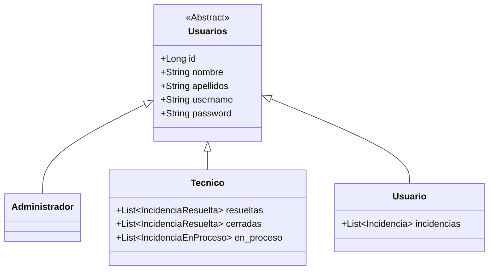
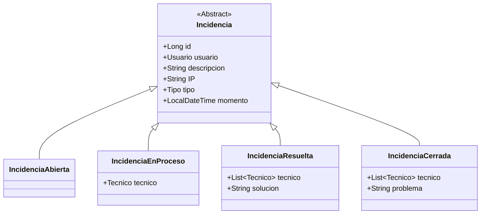

# Modelado

En este proyecto, estoy haciendo una página de gestión de incidencias informáticas.

Estas incidencias constarán de una **estado, descripción, tipo, fecha y hora, y IP del equipo afectado**.
Podrán tener 4 estados:
- **Abierta**: Aún no se ha asignado a ningún técnico.
- **En proces**o: La incidencia tendrá un técnico asignado y estará en proceso de ser resuelta.
- **Resuelta**: La incidencia ha sido resuelta, y se almacenará el ténico que la resolvió, la fecha, y una breve descripción de cómo se logró.
- **Cerrada**: La incidencia no pudo ser resuelta, se almacenará qué técnico intentó hacerlo, en qué fecha y hora y una breve descripción de la problemática.

Habrá 3 tipos de usuario:
- **Usuarios**: Pueden iniciar sesión con sus credenciales y reportar una incidencia mediante un formulario. Los usuarios no pueden registrarse de ninguna manera, pues es una aplicación diseñada para uso corporativo.
- **Técnicos**: Podrán visualizar una lista de incidencias pendientes, teniendo opción de ordenarlas por tipo y/o fecha. El técnico podrá asignarse una incidencia para resolverla él y no colisionar con sus compañeros. También podrá visualizar a qué técnico le fue asignada cada incidencia así como su estado.
- **Administradores**: Tendrán capacidad de gestionar todo tipo de datos, pudiendo  administrar tanto usuarios como sus respectivos roles. Existirá también una funcionalidad para importar usuarios / técnicos masivamente desde CSV.

---

# Enlaces

[Documentación de la API](Documentacion%20API.md)

---
# Diagramas de clases

### Usuarios

### Incidencias

---

# Diagrama entidad-relación

---
# Flujo incidencias

