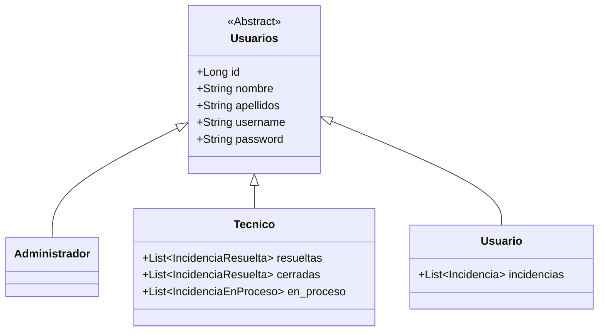
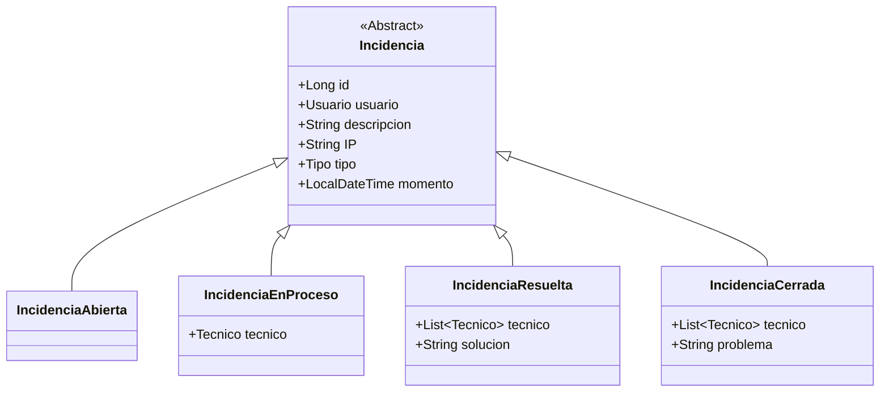

# Modelado

En este proyecto, estoy haciendo una página de gestión de incidencias informáticas.

Estas incidencias constarán de una **estado, descripción, tipo, fecha y hora, y IP del equipo afectado**.
Podrán tener 4 estados:
- **Abierta**: Aún no se ha asignado a ningún técnico.
- **En proces**o: La incidencia tendrá un técnico asignado y estará en proceso de ser resuelta.
- **Resuelta**: La incidencia ha sido resuelta, y se almacenará el ténico que la resolvió, la fecha, y una breve descripción de cómo se logró.
- **Cerrada**: La incidencia no pudo ser resuelta, se almacenará qué técnico intentó hacerlo, en qué fecha y hora y una breve descripción de la problemática. Estas incidencias podrán ser re-abiertas para resolverlas en otro momento.

Habrá 3 tipos de usuario:
- **Usuarios**: Pueden iniciar sesión con sus credenciales y reportar una incidencia mediante un formulario. Los usuarios no pueden registrarse de ninguna manera, pues es una aplicación diseñada para uso corporativo.
- **Técnicos**: Podrán visualizar una lista de incidencias pendientes, teniendo opción de ordenarlas por tipo y/o fecha. El técnico podrá asignarse una incidencia para resolverla él y no colisionar con sus compañeros. También podrá visualizar a qué técnico le fue asignada cada incidencia así como su estado.
- **Administradores**: Tendrán capacidad de gestionar todo tipo de datos, pudiendo borrar por completo incidencias y administrar tanto usuarios como sus respectivos roles. Existirá también una funcionalidad para importar usuarios / técnicos masivamente desde CSV.

---
# Diagramas de clases

### Usuarios


### Incidencias


---

# Diagrama entidad-relación


---
# Flujo incidencias


---

# Documentación de la API

---

## USUARIOS

---

### Crear usuario

**POST** `/api/user/create`

Crea un nuevo usuario (usuario, técnico o administrador).

**Body (form-data)**

| Campo | Tipo | Descripción |
|-----|-----|-----|
| username | String | Nombre de usuario único |
| password | String | Contraseña (mínimo 8 caracteres) |
| nombre | String | Nombre del usuario |
| apellido | String | Apellidos del usuario |
| privilegios | String | `usuario`, `tecnico`, `administrador` |

**Respuesta**

- Objeto `Usuario` recien creado
- `error: mensaje` → Si ocurre algún error

---

### Actualizar usuario

**PUT** `/api/user/update/{id}`

Actualiza los datos de un usuario (no cambia la contraseña).

**Path params**

- `id` → ID del usuario

**Body (form-data)**

| Campo | Tipo |
|-----|-----|
| username | String |
| nombre | String |
| apellido | String |

**Respuesta**

- Objeto `Usuarios` actualizado
- `error: mensaje` en caso de error

---

### Dar de baja usuario

**POST** `/api/user/disable/{id}`

Desactiva un usuario (no aparecerá como activo).

**Respuesta**

- `"success"`
- `"error: mensaje"`

---

### Reactivar usuario

**POST** `/api/user/enable/{id}`

Reactiva un usuario previamente desactivado.

**Respuesta**

- Objeto `Usuarios` reactivado
- `"error: mensaje"`

---

### Listar todos los usuarios

**GET** `/api/user/all`

**Respuesta**

- Lista de usuarios (`Usuarios[]`)

---

### Listar usuarios activos

**GET** `/api/user/active`

**Respuesta**

- Lista de usuarios activos (`Usuarios[]`)

---

### Obtener usuario por ID

**GET** `/api/user/{id}`

**Respuesta**

- Objeto `Usuarios`
- Error 404 si no existe

---

### Obtener usuario por username

**GET** `/api/user/name/{name}`

**Respuesta**

- Objeto `Usuarios`
- Error 404 si no existe

---

## INCIDENCIAS

---

### Obtener todas las incidencias

**GET** `/api/incidencia/all`

**Respuesta**

- Lista de incidencias de todos los estados:
  - `IncidenciaAbierta`
  - `IncidenciaEnProceso`
  - `IncidenciaResuelta`
  - `IncidenciaCerrada`

---

### Obtener incidencia por ID

**GET** `/api/incidencia/{id}`

**Respuesta**

- Objeto incidencia
- Error si no existe

---

### Obtener incidencias abiertas

**GET** `/api/incidencia/abiertas`

**Respuesta**

- Lista de `IncidenciaAbierta`

---

### Obtener incidencias abiertas por tipo

**GET** `/api/incidencia/abiertas/{tipo}`

Tipos permitidos:
`OTRO`, `HARDWARE`, `SOFTWARE`, `RED`, `ERROR`

**Respuesta**

- Lista de incidencias abiertas del tipo indicado
- Error si el tipo no es inválido

---

### Obtener incidencias en proceso

**GET** `/api/incidencia/enproceso`

**Respuesta**

- Lista de `IncidenciaEnProceso`

---

### Obtener incidencias resueltas

**GET** `/api/incidencia/resueltas`

**Respuesta**

- Lista de `IncidenciaResuelta`
- Incluye técnicos que han trabajado y la solución

---

### Obtener incidencias cerradas

**GET** `/api/incidencia/cerradas`

**Respuesta**

- Lista de `IncidenciaCerrada`
- Incluye motivo de cierre y técnicos involucrados

---

### Abrir incidencia

**POST** `/api/incidencia/abrir`

Crea una nueva incidencia (solo usuarios normales).

**Body (form-data)**

| Campo | Tipo | Descripción |
|-----|-----|-----|
| username | String | Usuario que abre la incidencia |
| descripcion | String | Descripción del problema |
| IP | String | IP desde la que se reporta |
| tipo | String | Tipo de incidencia |

**Respuesta**

- `IncidenciaAbierta` creada
- Error si el usuario no existe o el tipo no es válido

---

### Asignar o pasar incidencia a técnico

**POST** `/api/incidencia/pasar/{id_incidencia}/{id_tecnico}`

- Si está abierta → pasa a **en proceso**
- Si está en proceso → se reasigna a otro técnico

**Respuesta**

- `IncidenciaEnProceso`
- Error si el técnico no es válido o la incidencia no es asignable

---

### Resolver incidencia

**POST** `/api/incidencia/resolver/{id}`

Marca una incidencia en proceso como resuelta.

**Body (form-data)**

| Campo | Tipo |
|-----|-----|
| motivo | String |

**Respuesta**

- `IncidenciaResuelta`
- Incluye solución y técnicos implicados

---

### Cerrar incidencia

**POST** `/api/incidencia/cerrar/{id}`

Cierra una incidencia en proceso sin resolver.

**Body (form-data)**

| Campo | Tipo |
|-----|-----|
| motivo | String |

**Respuesta**

- `IncidenciaCerrada`
- Incluye motivo de cierre y técnicos implicados

---

### Incidencias de un técnico

**GET** `/api/incidencia/tecnico/{id}`

**Respuesta**

```json
{
  "enProceso": [],
  "resueltas": [],
  "cerradas": []
}
```

---

### Incidencias de un usuario

**GET** `/api/incidencia/usuario/{id}`

**Respuesta**
```json
{
  "abiertas": [],
  "enProceso": [],
  "resueltas": [],
  "cerradas": []
}
```

